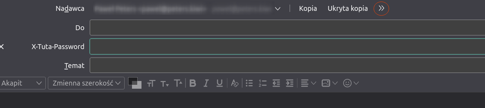

# IMAP & SMTP

The proxy exposes a standard IMAP4rev1 server on port `1143` and an SMTP server on port `1025`.

## Thunderbird setup

1. **Add account** → "Set up account manually" (skip autoconfig).

2. **Incoming (IMAP)**
   - Server: `localhost`
   - Port: `1143`
   - Connection security: **None**
   - Authentication: **Normal password**

3. **Outgoing (SMTP)**
   - Server: `localhost`
   - Port: `1025`
   - Connection security: **None**
   - Authentication: **Normal password**

4. Use your full Tuta email address as the username and your Tuta account password.

> Traffic stays on localhost. Credentials are used to authenticate with Tuta's API for the current session and are never stored to disk.

## Apple Mail setup

1. Mail → Add Account → Other Mail Account.
2. Fill in your name and Tuta email address.
3. For incoming: IMAP, server `localhost`, port `1143`, no SSL, password authentication.
4. For outgoing: SMTP, server `localhost`, port `1025`, no SSL, password authentication.

## What works

- Read mail from all folders (Inbox, Sent, Drafts, Trash, Spam, Archive, custom folders)
- Send mail — plain text, HTML, attachments
- Download attachments
- Folder create / rename / delete
- Move messages between folders (IMAP COPY)
- Read/unread flags
- Delete and EXPUNGE
- IDLE (push notifications — no polling needed)
- Saving and editing drafts

## Importing mail from another IMAP account

You can copy or move messages from Gmail or any other IMAP account into Tuta using IMAP APPEND.
The easiest way is with Thunderbird: add both accounts (your external account and the Tuta proxy),
then drag-and-drop messages or folders between them. Messages land in Tuta as properly encrypted
mail, including attachments.

## Sending encrypted mail to external recipients (Secure External)

Tuta's **Secure External** feature lets you send end-to-end encrypted email to anyone —
even if they don't have a Tuta account. The recipient gets a notification email with a link;
clicking it opens `app.tuta.com` where they enter a password you share with them out-of-band
to read the message.

The proxy activates this mode when the outgoing message includes the custom SMTP header
`X-Tuta-Password: <password>`. All recipients must be non-Tuta addresses.

### Setting up Thunderbird for Secure External

1. Open `about:config` (type it in the address bar or via Help → More Troubleshooting Information).
2. Search for `mail.compose.other.header` and set its value to:
   ```
   X-Tuta-Password
   ```
   If the preference already has other values, append with a comma: `...,X-Tuta-Password`.
3. In the compose window, click `>>` (top-right of the header area) and select
   `X-Tuta-Password` from the list.
4. Type the password in the new field. Share it with your recipient through a separate channel
   (phone call, Signal, etc.).



### Limitations

- The password must be shared with the recipient out-of-band.
- All recipients in one message must be non-Tuta addresses.
- Replies from the recipient arrive through Tuta's web portal, not your IMAP inbox.

## Known limitations

- No TLS between the email client and the proxy — traffic stays on localhost, unencrypted. Do not expose proxy ports to a network.
- IMAP SEARCH (full-text) is not implemented and will not be. Modern mail clients maintain their own local indexes and do not need server-side FTS. Adding a local encrypted index here would only duplicate data and widen the local data-leak surface. Currently `ALL` and `UNDELETED` are handled; all other search queries return an empty result.
- Tuta two-factor authentication (2FA) is not supported.
- One Tuta account per proxy instance.
